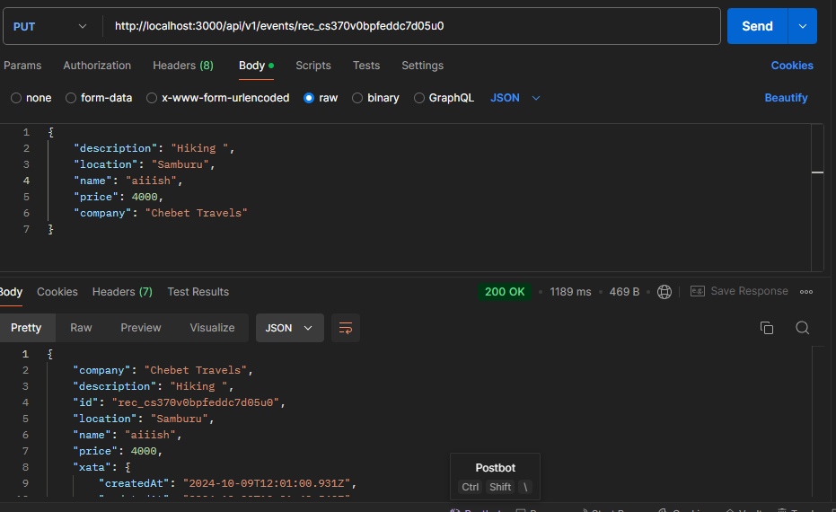
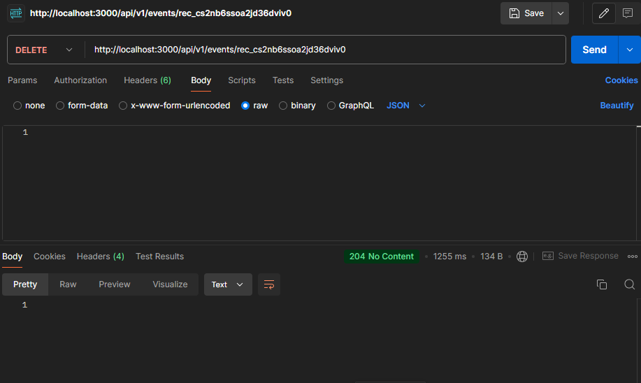

# Node.js CRUD API with Xata Database  
### Overview
This repository contains various Node.js tasks, including the implementation of a CRUD API connected to the **Xata** database. It demonstrates how to perform operations such as creating, reading, updating, and deleting records from a database using Node.js and Xata.
   
This project uses a Xata database to store and manage data for the CRUD API operations. Below is a screenshot of the database structure and the table where the data is stored.

### CRUD API Implementation
The following CRUD operations have been implemented:  
1. **GET Request**  
   *Endpoint:* `/api/records`  
   *Description:* Fetches all records from the Xata database table.  
     

2. **GET by ID Request**  
   *Endpoint:* `/api/records`  
   *Description:* Fetches a specific record by its ID from the Xata database.  
     

3. **POST Request**  
   *Endpoint:* `/api/records`  
   *Description:* Adds a new record to the Xata database.  
   

4. **PUT Request**  
   *Endpoint:* `/api/records`  
   *Description:* updates a record already in the Xata database.  
   

5. **DELETE Request**  
   *Endpoint:* `/api/records`  
   *Description:* Deletes a record from the Xata database.  
     
   
### Technologies Used
- **Node.js**: Backend framework for running JavaScript on the server side.
- **Xata Database**: Cloud-native database service used for storing and managing data.
- **JavaScript, TypeScript, HTML, CSS**: For handling API logic and front-end interface where applicable.

### How to Run the Project
1. Clone the repository:
   ```bash
   git clone https://github.com/devshakie/NODEJS.git
   
2. Install dependencies:   
   cd NODEJS
   npm install
   
4. Run the application:
   npm start


