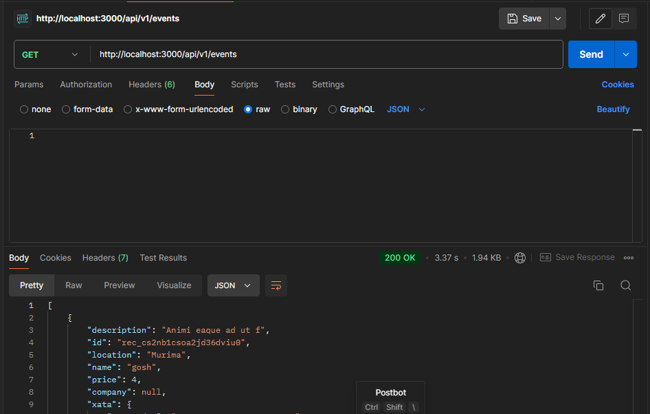
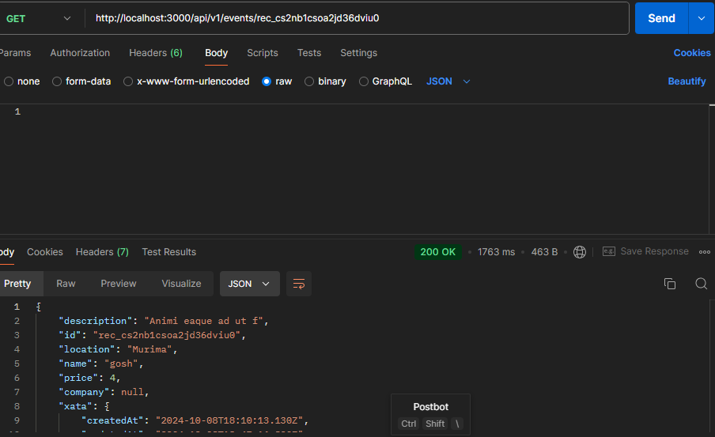
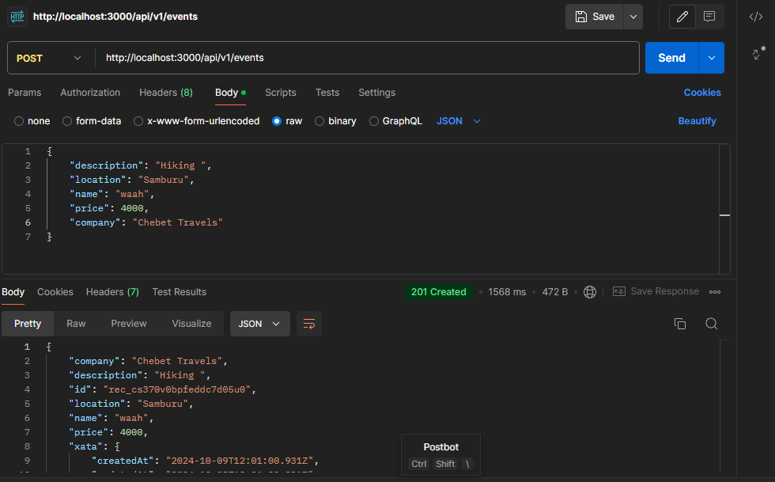

# Node.js CRUD API with Xata Database  
### Overview
This repository contains various Node.js tasks, including the implementation of a CRUD API connected to the **Xata** database. It demonstrates how to perform operations such as creating, reading, updating, and deleting records from a database using Node.js and Xata.
   
This project uses a Xata database to store and manage data for the CRUD API operations. Below is a screenshot of the database structure and the table where the data is stored.

### CRUD API Implementation
The following CRUD operations have been implemented:  
1. **GET Request**  
   *Description:* Fetches all records from the Xata database table.  
     

2. **GET by ID Request**  
   *Description:* Fetches a specific record by its ID from the Xata database.  
     

3. **POST Request**  
   *Description:* Adds a new record to the Xata database.  
   

3. **PUT Request**  
   *Description:* updates a record already in the Xata database.  
   

5. **DELETE Request**  
   *Description:* Deletes a record from the Xata database.  
     
   
   

Below is a screenshot of a sample get by id request.

Below is a screenshot of a sample post request.
   
Below is a screenshot of a sample get request.
    
Below is a screenshot of a sample delete request.
 

