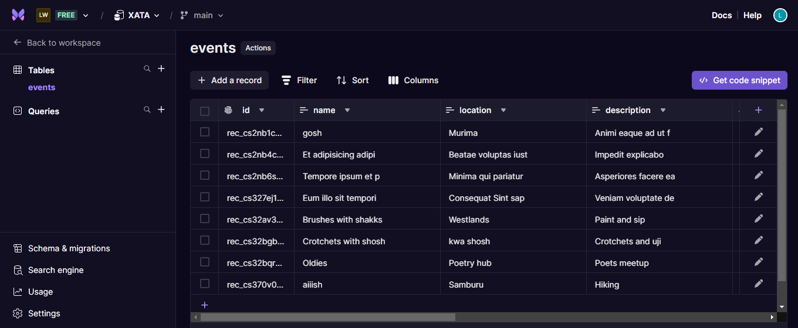

# Node.js CRUD API with Xata Database  
### Overview
This repository contains various Node.js tasks, including the implementation of a CRUD API connected to the **Xata** database. It demonstrates how to perform operations such as creating, reading, updating, and deleting records from a database using Node.js and Xata.
   
This project uses a Xata database to store and manage data for the CRUD API operations. Below is a screenshot of the database structure and the table where the data is stored.   

### CRUD API Implementation
The following CRUD operations have been implemented:  
1. **GET Request**  
   *Endpoint:* `/api/v1/events`  
   *Description:* Fetches all records from the Xata database table.  
     

2. **GET by ID Request**  
   *Endpoint:* `/api/v1/events:id`  
   *Description:* Fetches a specific record by its ID from the Xata database.  
     

3. **POST Request**  
   *Endpoint:* `/api/v1/events`  
   *Description:* Adds a new record to the Xata database.  
   

4. **PUT Request**  
   *Endpoint:* `/api/v1/events:id`  
   *Description:* updates a record already in the Xata database.  
   

5. **DELETE Request**  
   *Endpoint:* `/api/v1/events:id`  
   *Description:* Deletes a record from the Xata database.  
     
   
### Technologies Used
- **Node.js**: Backend framework for running JavaScript on the server side.
- **Xata Database**: Cloud-native database service used for storing and managing data.
- **JavaScript, TypeScript, HTML, CSS**: For handling API logic and front-end interface where applicable.

  
## Prerequisites

Before running this project, ensure that you have the following installed:

- **[Node.js](https://nodejs.org/en/)**: Version 14.x or later
- **[Xata Account](https://xata.io/)**: A Xata account and an active database. You'll need your Xata API key and database URL for the project.


### How to Run the Project
1. Clone the repository:
   ```bash
   git clone https://github.com/devshakie/NODEJS.git
   
2. Install dependencies:   
   ```bash
    cd NODE
   npm install

3. Add environment variables to your .env file
    ```bash
   XATA_API_KEY=your-xata-api-key
   XATA_DATABASE_URL=your-xata-database-url
   
4. Run the application:
   ```bash
   npm start

 ### Contact   
For any questions or suggestions, feel free to contact me via [LinkedIn](https://www.linkedin.com/in/luckshakira-kanana-0733b923b)


